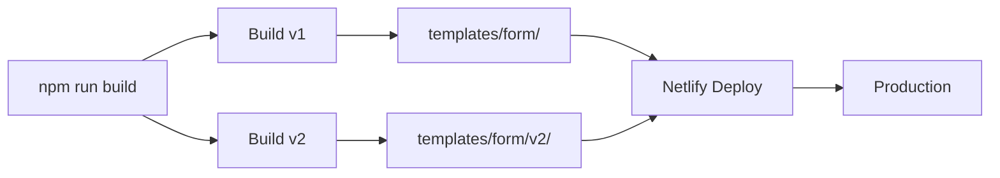

# 🚀 Migration Progressive vers React v2

## 📋 Résumé

Votre application DocEase est maintenant configurée pour déployer **deux versions en parallèle** :

| Version | Technologie | URL | Status |
|---------|-------------|-----|--------|
| **v1** | HTML/JS + Tailwind | `/` | ✅ Production stable |
| **v2** | React + TypeScript | `/v2/` | 🚧 En développement |

## 🎯 Démarrage rapide

### 1️⃣ Tester localement

```bash
cd templates
.\test-both-versions.ps1
```

Cela ouvre :
- 🌐 http://localhost:8080 (version classique)
- ⚛️ http://localhost:3000 (version React)

### 2️⃣ Déployer

```bash
git add .
git commit -m "feat: ajout version React v2"
git push
```

Netlify déploie automatiquement sur :
- 🌐 `https://votre-site.netlify.app/` (v1)
- ⚛️ `https://votre-site.netlify.app/v2/` (v2)

### 3️⃣ Développer la v2

```bash
cd templates/formulaire
npm run dev
```

Éditer les fichiers dans `templates/formulaire/` :
- `App.tsx` - Composant principal
- `components/` - Composants React
- `constants.ts` - Configuration
- `types.ts` - Types TypeScript

## 📚 Documentation

| Fichier | Description |
|---------|-------------|
| **[QUICK_START_V2.md](QUICK_START_V2.md)** | Guide de démarrage rapide |
| **[MIGRATION_V2.md](MIGRATION_V2.md)** | Architecture et stratégie de migration |
| **[DEPLOYMENT_GUIDE.md](DEPLOYMENT_GUIDE.md)** | Guide complet de déploiement |
| **[DEPLOYMENT_CHECKLIST.md](DEPLOYMENT_CHECKLIST.md)** | Checklist avant/après déploiement |

## 🏗️ Architecture

```
templates/
├── form/                       # Version 1 (source)
│   ├── index.html
│   ├── components/
│   ├── assets/
│   └── v2/                     # Version 2 (build généré)
│       ├── index.html
│       └── assets/
│
└── formulaire/                 # Version 2 (source)
    ├── App.tsx
    ├── components/
    └── vite.config.ts
```

## 🔄 Workflow de build



## 🛠️ Commandes

```bash
# Build complet (les deux versions)
npm run build

# Build v1 uniquement
npm run build:form

# Build v2 uniquement
npm run build:react

# Dev v2
cd templates/formulaire && npm run dev

# Tests locaux
cd templates && .\test-both-versions.ps1
```

## 🔗 Navigation

Des badges ont été ajoutés dans les headers :

- **Dans v1** : Badge "Essayer v2" → `/v2/`
- **Dans v2** : Badge "Version classique" → `/`

## ⚠️ Important

- ❌ Ne **jamais** éditer directement `templates/form/v2/`
- ✅ Toujours éditer les sources dans `templates/formulaire/`
- ✅ Le dossier `v2/` est généré automatiquement par le build
- ✅ Le `.gitignore` exclut `v2/` du versioning

## 🎨 Développement

### Modifier la version classique (v1)
```bash
cd templates/form
# Éditer les fichiers HTML/JS
npm run build
```

### Modifier la version React (v2)
```bash
cd templates/formulaire
# Éditer les fichiers React/TS
npm run dev    # Mode développement
npm run build  # Build production
```

## 🚀 Stratégie de migration

### Phase 1 : Coexistence (Actuelle) ✅
- Les deux versions sont déployées
- Tests et itérations sur v2

### Phase 2 : Tests utilisateurs
- Partager `/v2/` avec des testeurs
- Collecter les retours
- Corriger les bugs

### Phase 3 : Bascule
- Inverser les routes :
  - `/` → version React
  - `/v1/` → version classique (fallback)

### Phase 4 : Décommissionnement
- Supprimer l'ancienne version

## 🐛 Troubleshooting

### Le build échoue
```bash
cd templates/form && rm -rf node_modules v2 && npm install
cd templates/formulaire && rm -rf node_modules && npm install
npm run build
```

### La v2 ne s'affiche pas
1. Vérifier que `templates/form/v2/` existe
2. Vérifier les logs de build Netlify
3. Vérifier les redirections dans `netlify.toml`

## 📊 Avantages

✅ **Zéro downtime** - L'ancienne version reste accessible  
✅ **Tests en production** - Tester v2 avec de vrais utilisateurs  
✅ **Rollback facile** - Retour arrière instantané si problème  
✅ **Migration progressive** - Pas de big bang  
✅ **Comparaison** - Possibilité de comparer les deux versions  

## 🎉 Prêt à déployer !

Tout est configuré. Suivez le [QUICK_START_V2.md](QUICK_START_V2.md) pour démarrer.

---

**Questions ?** Consultez la documentation complète dans les fichiers listés ci-dessus.

